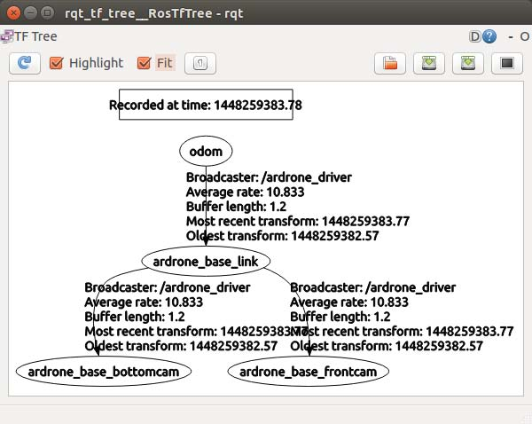
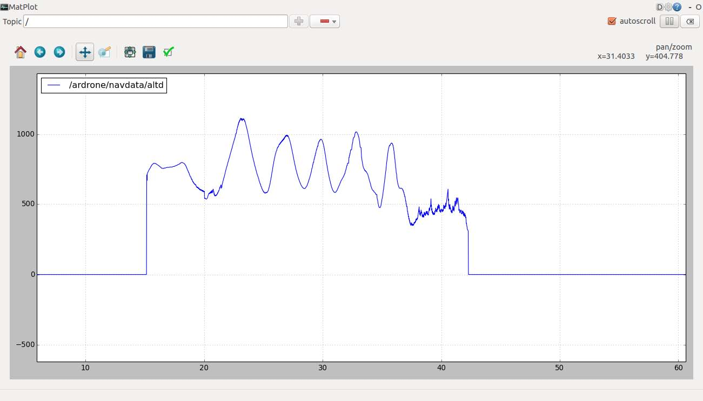
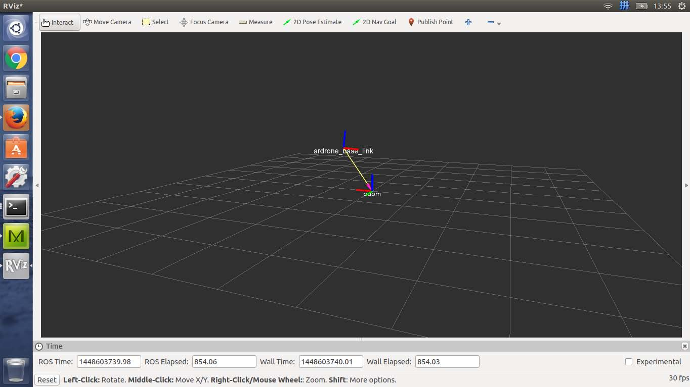

#ROS下ARdrone开发探索(2)

##2.1飞行器坐标系及其坐标变换
在ardrone的驱动中一共有三个坐标系,世界坐标系(odom),机体坐标系(base_link),前置摄像头的坐标系(base_frontcam).底部摄像头的坐标系base_bottomcam).他们之间有如图所示的坐标变换关系:

可见一共由三个坐标系变换关系.
这里我举个例子,来说明他们的关系:
如果前置摄像头探测到了一个物体在它的坐标系的某个位置,通过坐标变换就能得到这个物体在机体坐标系里边的坐标
这也是ROS非常强大的一个功能,具体可以参见TF
这里可以做一些简单的实验:
```
# rosrun ardrone_autonomy/ ardrone_driver
# rosrun tf tf_monitor
RESULTS: for all Frames
Frames:
Frame: ardrone_base_bottomcam published by uknown_publisher
Average Delay: 0.000574263 Max Delay: 0.0217861
Frame: ardrone_base_frontcam published by unknown_publisher
Average Delay: 0.000538786 Max Delay: 0.021772
Frame: ardrone_base_link published by unknown_publisher Average
Delay: 0.000599941 Max Delay: 0.0217936
All Broadcasters:
Node: unknown_publisher 30.0302 Hz, Average Delay: 0.000609153 Max
Delay: 0.0217936
```
以上命令在控制台中显示了所有的坐标变换树.
```
# rosrun tf tf_echo /ardrone_base_frontcam /odom
At time 1448440504.155
- Translation: [-0.397, -0.021, 0.116]
- Rotation: in Quaternion [0.584, -0.410, 0.424, 0.558]
in RPY (radian) [1.628, -1.262, -0.016]
in RPY (degree) [93.289, -72.305, -0.925]
At time 1448440505.155
- Translation: [-0.396, -0.021, 0.116]
- Rotation: in Quaternion [0.584, -0.409, 0.424, 0.558]
in RPY (radian) [1.627, -1.260, -0.015]
in RPY (degree) [93.234, -72.218, -0.845]
At time 1448440506.155
- Translation: [-0.396, -0.021, 0.117]
- Rotation: in Quaternion [0.585, -0.409, 0.424, 0.558]
in RPY (radian) [1.627, -1.259, -0.014]
in RPY (degree) [93.195, -72.127, -0.790]
```
以上使用TF_echo 工具 展示了frontcam 坐标和ODOM坐标之间的变换关系和变换阵.

##2.2 控制ARdrone飞行

初次测试,需要用工具卸下是个螺旋桨.
启动驱动节点
```
# roslaunch ardrone_autonomy ardrone.launch
# rostopic pub -1 /ardrone/reset std_msgs/Empty
# rostopic pub -1 /ardrone/takeoff std_msgs/Empty
```
这是缓缓拿起飞行器,到0.5米左右高度,在新窗口打开这个命令
```
# rosrun rqt_plot rqt_plot /ardrone/navdata/altd
```
这是拿起飞行器,抬高降低,就能看到在波形图中的高度变化趋势

这里还可以使用rviz,实时查看整个飞行器的TF数据.
```
# rviz
```
在Add 选项中加入TF显示工具,注意,此时需要将显示选项卡(Displays),中Global Optitons中的固定坐标系选择为odom.此时在3维界面中就能看到相应的坐标变换图像.如下:

这时,可以尝试启动飞行器,并用手模拟飞行器在空中运动,能够在RVIZ中清楚的看到飞行器位置和姿态的变化.这里我对TF显示进行了设置,只选取了ardrone_base_link坐标系.

在飞行中可以发布控制命令消息到CMD_VEL节点触发自动悬停模式(需要飞行器处于 空中)
```
# rostopic pub -1 /cmd_vel geometry_msgs/Twist '{linear:{x: 0,y:
0,z: 0},angular:{x: 0,y: 0,z: 0}}'
```
其中修改线速度和角速度的值可以控制飞行器飞行.

##2.3 一些服务
在ARdrone 驱动中还提供了一些服务比如点亮LED灯,飞行器水平校正,关闭开启U盘存储功
能和一些参数设置服务.具体就不在这进行说明了. 

##2.4 总结
到此基本完成了ARdrone在ROS环境下的基本功能测,下一步将开发一个小功能.发布控制指
令让飞行器升空并围绕YAW轴旋转360度后.降落.